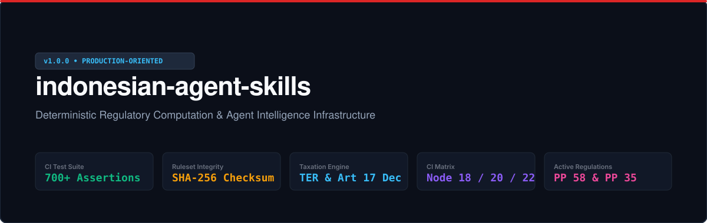

# Indonesian Agent Skills (`indonesian-agent-skills`) 🇮🇩

```text
 ___ _   _ ____   ___  _   _ _____ ____  _       _     ____ _____  _    ____ _  __
|_ _| \ | |  _ \ / _ \| \ | | ____/ ___|(_) __ _| |   / ___|_   _|/ \  / ___| |/ /
 | ||  \| | | | | | | |  \| |  _| \___ \| |/ _` | |   \___ \ | | / _ \| |   | ' / 
 | || |\  | |_| | |_| | |\  | |___ ___) | | (_| | |___ ___) || |/ ___ \ |___| . \ 
|___|_| \_|____/ \___/|_| \_|_____|____/|_|\__,_|_____|____/ |_/_/   \_\____|_|\_\
```

<p align="center">
  
</p>

<p align="center">
  <a href="LICENSE"></a>
  <a href="https://github.com/adamriofc/indonesian-agent-skills/actions/workflows/ci.yml"></a>
  <a href="https://app.openworklabs.com/"></a>
  <a href="engines/"></a>
  <a href="tests/"></a>
</p>

---

## ⚡ The Unfair Advantage (Why This Exists)

In the Indonesian business landscape, compliance is governed by highly localized, frequently amended laws (such as PP 58/2023 for tax, PP 35/2021 for employment, and UU 27/2022 for PDP). 

Standard AI LLMs (like GPT-4, Gemini, or Claude) are probabilistic; they predict the next token based on statistical patterns. When asked to draft contracts, calculate withholdings, or process severance, LLMs suffer from three critical failures:
1. **Mathematical Hallucination**: LLMs do not execute calculations; they guess the output. This results in inaccurate tax calculations (e.g. wrong TER bracket matching) and incorrect severance payouts.
2. **Lack of Temporal Awareness**: An LLM cannot inherently distinguish between a BPJS wage cap in January 2025 vs. March 2025. It will silently apply outdated rules.
3. **No Chain of Custody (Provenance)**: Outputs lack references to official gazettes (Lembaran Negara), making them unverifiable in audits.

`indonesian-agent-skills` provides a **moat for AI agents** by wrapping standard LLM instructions around **deterministic Node.js calculation engines** (`engines/`) and versioned regulatory rulesets (`engines/rules/`). The LLM is used strictly for parameter extraction and narrative synthesis, guaranteeing **100% mathematical accuracy and legal traceability**.

---

## 🏗️ System Architecture

```text
                                [ User / Agent Query ]
                                          │
                                          ▼
                      ┌──────────────────────────────────────┐
                      │    Skill Instruction Layer (MD)      │
                      │ Extracts parameters & structured JSON│
                      └──────────────────┬───────────────────┘
                                         │
                                         ▼
                      ┌──────────────────────────────────────┐
                      │ Deterministic Node.js Engines        │
                      │ (engines/*.js)                       │
                      └──────────────────┬───────────────────┘
                                         │
               ┌─────────────────────────┴────────────────────────┐
               ▼                                                  ▼
┌──────────────────────────────┐              ┌──────────────────────────────────────┐
│ Single Source of Truth Rules │              │ Cryptographic SHA-256 Checksums     │
│ (engines/rules/*.json)       │              │ (engines/rules/integrity.js)         │
└──────────────┬───────────────┘              └──────────────────┬───────────────────┘
               │                                                 │
               └─────────────────────────┬───────────────────────┘
                                         │
                                         ▼
                      ┌──────────────────────────────────────┐
                      │ Validated Statutory Output + Math    │
                      └──────────────────┬───────────────────┘
                                         │
                                         ▼
                      ┌──────────────────────────────────────┐
                      │ LLM Narrative Synthesis & Formatting │
                      └──────────────────────────────────────┘
```

---

## ⚖️ Comparative Scenarios: Pure LLM vs. Hybrid Engine

### Scenario 1: PPh 21 Calculation for Gross Salary Rp 10.000.000 (TK/0 PTKP)
* **Pure LLM Output**: Usually guesses the tax rate as a flat 5% or applies an outdated PTKP deduction first, resulting in incorrect calculations.
* **Hybrid Engine Output**: The LLM extracts `{ grossSalary: 10000000, ptkpStatus: "TK/0" }` and passes it to the engine. The engine matches the salary to **TER Category A (2.0%)** per PP 58/2023, returning exactly **Rp 200.000** with a cryptographic audit trail.

### Scenario 2: BPJS Wage Cap Transition on March 15, 2025
* **Pure LLM Output**: Hallucinates the BPJS JP Cap as Rp 10.042.300 (the 2024 cap) or Rp 12.000.000.
* **Hybrid Engine Output**: The engine checks the transition date (`2025-03-15`) against `bpjs.json` and automatically pulls the correct updated cap of **Rp 10.547.400** per Surat Edaran BPJS Ketenagakerjaan B/726/022025.

---

## 🔌 Compatibility & Integration Directory

| Application / Platform | Native Support | Integration Method | Verified Status |
|---|---|---|---|
| **OpenWork Desktop & Cloud** | Yes | Native manifest (`plugin.json`) load. | 🟢 Native |
| **OpenCode CLI** | Yes | Direct terminal import via `opencode plugins add`. | 🟢 Native |
| **Claude Code (CLI) & Cowork** | Yes | Loadable as custom tools or knowledge bases. | 🟢 Native |
| **Cursor IDE** | Yes | Context file loading via `.cursorrules` or `.mdc`. | 🟡 Adapter |
| **VS Code Agent** | Yes | Workspace prompt rules under `.vscode/settings.json`. | 🟡 Compatible |
| **Gemini CLI & Codex** | Yes | Imported as external system prompts. | 🟡 Compatible |
| **ChatGPT / Custom GPTs** | Yes | Upload files in the GPT Builder knowledge database. | 🟡 Manual |

---

## 🛠️ Installation & Setup Guide

### 1. OpenWork Desktop & Cloud
OpenWork automatically registers the plugins upon adding the repository:
1. Open **Settings > Plugins**.
2. Click **Add Plugin from Repository**.
3. Input the GitHub URL: `https://github.com/adamriofc/indonesian-agent-skills`.
4. The 5 plugins and 26 skills will activate automatically in your workspace.

### 2. OpenCode CLI
Install the plugins directly from your terminal:
```bash
opencode plugins add adamriofc/indonesian-agent-skills
```

### 3. Claude Code (CLI)
Link the skills directory to Claude Code's config context:
```bash
claude plugins add adamriofc/indonesian-agent-skills
```

### 4. Cursor IDE
To instruct Cursor's agent to use these rules, copy `.cursorrules` configurations to your project root:
```bash
mkdir -p .cursorrules.d
cp -r /tmp/opencode/indonesian-agent-skills/legal-id/skills/ .cursorrules.d/
```
Or create a `.cursorrules` file pointing to this repository as a submodule.

### 5. VS Code Agent (Copilot / Cline / Roo Code)
Configure VS Code's system instructions by adding the path to your settings:
```json
{
  "roo-code.systemPromptPath": "/absolute/path/to/indonesian-agent-skills/legal-id/skills/contract-reviewer/SKILL.md"
}
```

---

## 📦 Plugin Inventory & Skill Catalog

### 1. `legal-id` — Commercial Law & Compliance
* `contract-reviewer`: Audits agreements and outputs a **Contract Risk Score (0-100)** with redlines.
* `spk-generator`: Drafts bilateral service contracts compliant with KUHPerdata Arts. 1320 & 1338.
* `nda-indonesia`: Drafts NDAs with liquidated damages under Indonesian jurisdiction.
* `pdp-compliance`: Audits processing workflows against all 6 Lawful Bases of UU PDP No. 27/2022.
* `legal-memo-id`: Formats disputes into structured Legal Memos (*Posita*, *Legal Basis*, *Analysis*).

### 2. `tax-payroll-id` — Indonesian Tax Engine
* `pph21-calculator`: TER monthly calculation engine (PP 58/2023) & Dec Annual Reconciliation.
* `efaktur-helper`: Validates e-Faktur 4.0 transaction codes (010-090) and PPN 11% matching.
* `thr-calculator`: Payout engine for religious holiday allowances.
* `bpjs-calculator`: Calculations for health and social security contribution splits.
* `spt-tahunan-guide`: Filing workflow for individual tax returns via DJP Online.

### 3. `hr-id` — Labor & Employment Compliance
* `surat-peringatan`: Drafts SP1, SP2, and SP3 warning letters following 6-month statutory windows.
* `sop-perusahaan`: Generates SOPs enforcing overtime limits (Perpu 2/2022 max 4h/day, 18h/week).
* `interview-id`: Candidate scorecards evaluating technical skills and local cultural fit.
* `bpjs-tenagakerja-admin`: SIPP BPJS portal administration workflow guide.
* `phk-calculator`: Statutory severance payout engine under PP 35/2021.

### 4. `ecommerce-id` — Marketplace Operations & SEO
* `deskripsi-produk-seo`: Structural product copy optimized for Shopee & Tokopedia search.
* `cs-komplain-handler`: Customer service protocols for negative reviews and damaged packages.
* `analisis-kompetitor-marketplace`: Extracts feedback gaps from competitor listings.
* `shopee-live-script`: Retention and flash-sale hosting scripts for live streaming.
* `tokopedia-seo-optimizer`: Algorithmic title formula generator (`[Product] + [Brand] + [Spec] + [Keywords]`).
* `buyer-negotiator`: Wholesale (grosir) B2B trade terms negotiation guidelines.

### 5. `content-lokal-id` — Local Copywriting
* `whatsapp-broadcast`: High-conversion anti-spam WhatsApp Business copy.
* `linkedin-x-thread-id`: B2B executive narrative storytelling formats.
* `script-reels-tiktok`: Short-video scripts with visual directions and audio overlays.
* `lokalisasi-slang-indonesia`: Adapts formal copy into natural Indonesian business casual or colloquial tone.
* `press-release-id`: Indonesian 5W+1H journalistic press release template.

---

## 🧪 Testing & Conformance Suite

Verify the deterministic engine and golden corpus tests locally:
```bash
npm install
npm test
```

Our test harness executes over **700+ individual test assertions** across 7 automated test modules:
1. **Dynamic Schema Validation (`tests/schema/validator.test.js`)**: Verifies plugin manifests and checks YAML frontmatter tags for duplicate keys.
2. **Cryptographic Checksums (`tests/units/engines.test.js`)**: Asserts that ruleset files match expected SHA-256 hashes and verifies that tampered files fail closed.
3. **PPh 21 TER Matrix Test (`tests/units/pph21-matrix.test.js`)**: **425 test cases** verifying every bracket boundary across TER Category A, B, and C.
4. **PHK Severance Matrix Test (`tests/units/phk-matrix.test.js`)**: **225 test cases** evaluating 25 tenure years across all 9 statutory reasons under PP 35/2021.
5. **E2E Integration Test (`tests/integration/workflow.test.js`)**: Evaluates complete employee lifecycle calculations.
6. **Prompt Injection Defense Test (`tests/security/injection.test.js`)**: Confirms prompt boundaries are present in ingestion skills.
7. **Adversarial Ingestion Test (`tests/security/adversarial.test.js`)**: Asserts that parameter hijacking, negative inputs, and scripts are neutralized.

---

## ❓ FAQ (Frequently Asked Questions)

### Q: Does this repository require external API keys?
**A**: No. The calculators run natively in JavaScript, and the instruction files use markdown. The system uses the active LLM of your agent runtime (Claude, GPT, Gemini).

### Q: How do you handle changes in tax or employment laws?
**A**: All statutory parameters are stored in versioned JSON rulesets under `engines/rules/`. When a law changes, we add the new ruleset with its corresponding `effective_from` date and update its SHA-256 checksum.

### Q: Why throw errors on unsupported dates rather than fall back?
**A**: For regulatory compliance, silent fallbacks are dangerous. It is better to fail loudly than to compute incorrect taxes or severance calculations under the wrong legal era.

---

## 🛡️ Security & Disclaimers

See [`SECURITY.md`](SECURITY.md) for prompt injection defense guidelines and [`PROVENANCE.md`](PROVENANCE.md) for statutory gazette registers.

**Statutory Disclaimer**: *This project provides decision-support tools and deterministic calculation models. Outputs do not constitute formal legal, tax, or accounting advice. High-risk decisions (such as PHK severance execution or contract execution) require review by a licensed advocate or tax consultant.*

## 📄 License

MIT License. See [LICENSE](LICENSE) for details.
