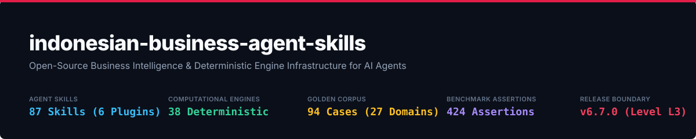

# Indonesian Business Agent Skills

*Give AI agents a business brain for Indonesia.*

**Open-source Indonesian business intelligence for AI agents — combining regulatory-grounded skills, temporal rulesets, deterministic engines, and auditable provenance.**

<p align="center">
  
</p>

<p align="center">
  <a href="LICENSE"></a>
  <a href="https://github.com/adamriofc/indonesian-business-agent-skills/actions/workflows/ci.yml"></a>
  <a href="https://app.openworklabs.com/"></a>
  <a href="engines/"></a>
  <a href="tests/"></a>
</p>

---

## 📌 Overview & Value Proposition

**Indonesian Business Agent Skills** is an open-source domain-intelligence infrastructure designed to give AI agents an authentic Indonesian business and regulatory intelligence layer. Built for **OpenWork Desktop**, **OpenCode CLI**, **Claude Code (CLI)**, **Cursor IDE**, **Codex**, and custom agent frameworks, this repository integrates **67 Agent Skills** with **23 Deterministic Computational & Regulatory Diff Engines** (`engines/`) and single-source-of-truth temporal JSON rulesets (`engines/rules/`).

### 💡 Why Standard LLMs Fail at Indonesian Business & Compliance Calculations
Generic AI models (such as unassisted ChatGPT or Claude) predict words probabilistically (*token prediction*). When tasked with calculating TER PPh 21 income tax, PHK severance payouts, or corporate loan interest, standard LLMs encounter 3 critical failure modes:
1. **Arithmetic Hallucination**: AI models guess numbers rather than computing equations, leading to incorrect tax bracket assignments and faulty severance math.
2. **Temporal Ambiguity**: AI models fail to track statutory wage caps and rate adjustments across transition windows (such as BPJS JP wage cap adjustments in March 2025 vs March 2026).
3. **Unverifiable Lineage**: Standard AI responses lack traceable references to official gazettes (*lembaran negara*), rendering them unsuited for corporate audits.

### 🛡️ The Hybrid Architecture Solution
This repository decouples AI **reasoning** from **calculation**:
- **AI (Agent Skill)**: Understands natural language, extracts parameters, and synthesizes explanations.
- **Engine (Node.js)**: Computes exact invariant mathematics (0% hallucination) per official government rulesets.

---

## ⚡ 30-Second Quickstart Demo

```bash
# 1. Clone the repository (5 seconds)
git clone https://github.com/adamriofc/indonesian-business-agent-skills.git && cd indonesian-business-agent-skills

# 2. Install (10 seconds, 0 external dependencies)
npm ci

# 3. Execute precise PPh 21 TER tax calculation (2 seconds)
node -e "
const { calculatePPh21Monthly } = require('./engines/pph21-calculator');
console.log(calculatePPh21Monthly(10000000, 'TK/0', true, '2026-03-01'));
"

# 4. Verify cryptographic SHA-256 ruleset integrity (2 seconds)
./scripts/sha256sums.sh verify

# 5. Run full test suite: 900+ assertions (30 seconds)
npm test
```

> 🌐 **Interactive No-Code Demo**: Open `docs/playground.html` directly in your browser to test interactive calculators for PPh 21, PP 20/2026 UMKM tax, Break-Even Analysis, and Loan Amortization!

---

## 🏗️ System Architecture

```text
                                 [ User / Agent Query ]
                                           │
                                           ▼
                       ┌──────────────────────────────────────┐
                       │    Skill Instruction Layer (MD)      │
                       │ Extracts parameters & structured JSON│
                       └──────────────────┬───────────────────┘
                                          │
                                          ▼
              ┌──────────────────────────────────────────────────────┐
              │      23 Deterministic Node.js Math & Diff Engines    │
              │ 15 statutory (engines/*.js + SSOT temporal rulesets) │
              │ 8 finance (engines/*.js — pure standard math)        │
              └──────────────────┬───────────────────┬───────────────┘
                                 │                   │
                                 ▼                   ▼
      ┌──────────────────────────────┐   ┌──────────────────────────────────────┐
      │ Single Source of Truth Rules │   │ Cryptographic SHA-256 Checksums     │
      │ (engines/rules/*.json)       │   │ (engines/rules/integrity.js +        │
      │ — statutory & policy only    │   │  SHA256SUMS.txt)                     │
      └──────────────┬───────────────┘   └──────────────────┬───────────────────┘
                     │                                      │
                     └──────────────────────────┬───────────┘
                                                │
                                                ▼
                         ┌──────────────────────────────────────┐
                         │  Validated Statutory Output + Math   │
                         └──────────────────┬───────────────────┘
                                            │
                                            ▼
                         ┌──────────────────────────────────────┐
                         │ LLM Narrative Synthesis & Formatting │
                         └──────────────────────────────────────┘
```

---

## 🛠️ Installation & Integration Guide

### 1. Universal Agent Skills CLI (Recommended / Universal)
Install skills directly across any supported agent framework (Claude Code, OpenCode, Codex, Cursor, Antigravity) using `npx`:
```bash
# Install all skills across the repository
npx skills add adamriofc/indonesian-business-agent-skills

# Selective installation by agent platform or skill domain
npx skills add adamriofc/indonesian-business-agent-skills --agent claude-code
npx skills add adamriofc/indonesian-business-agent-skills --skill pph21-calculator
```

### 2. Claude Code Marketplace (Official Plugin Integration)
Register the repository as a marketplace source and install individual plugins:
```bash
# Add the repository as a plugin marketplace source
claude plugin marketplace add adamriofc/indonesian-business-agent-skills

# Install individual plugins from the marketplace
claude plugin install legal-id@indonesian-business-agent-skills
claude plugin install tax-payroll-id@indonesian-business-agent-skills
claude plugin install finance-id@indonesian-business-agent-skills
```

### 3. Portable Agent Skills Standard (.agents / .opencode / .cursor)
For native skill discovery without plugins, copy skills to the `.agents/skills/` directory:
```bash
# Canonical cross-agent skills directory
mkdir -p .agents/skills
cp -r legal-id/skills/* .agents/skills/
cp -r tax-payroll-id/skills/* .agents/skills/
cp -r finance-id/skills/* .agents/skills/

# OpenCode & Cursor native paths
mkdir -p .opencode/skills .cursor/skills
cp -r .agents/skills/* .opencode/skills/
cp -r .agents/skills/* .cursor/skills/
```

### 4. OpenWork Desktop & Cloud
1. Open **Settings > Plugins**.
2. Click **Add Plugin from Repository**.
3. Input the GitHub URL: `https://github.com/adamriofc/indonesian-business-agent-skills`.
4. The 6 plugins and 67 skills activate automatically.

---

## 📦 Plugin Inventory & Skill Catalog (71 Skills Across 6 Plugins)

All skills and computational engines are mapped in the **Machine-Readable Registry (`registry/index.json`)** with defined *Quality Tiers* (`source-verified`, `tested`, `expert-reviewed`):

### 1. `legal-id`: Commercial Law & Compliance (9 Skills)
* `contract-reviewer`: Audits agreements and outputs a **Contract Risk Score (0-100)** with redlines.
* `compliance-risk`: Multi-Domain Compliance Health Audit (Tax, HR, Legal, PDP, Commerce) outputting a Compliance Score (0-100) & remediation roadmap.
* `spk-generator`: Drafts bilateral service contracts compliant with KUHPerdata Arts. 1320 & 1338.
* `nda-indonesia`: Non-disclosure agreements with DJKI & UU Trade Secret protections.
* `pdp-compliance`: Corporate personal data protection audit under UU No. 27/2022.
* `legal-memo-id`: Indonesian court-spec legal opinions and conflict analysis.
* `haki-trademark-check`: Trademark availability check under UU 20/2016 (Classes 1-45).
* `oss-kbli-navigator`: Maps activities to 5-digit KBLI 2020 and OSS-RBA risk levels.
* `somasi-draft-id`: Drafts formal advocate-standard legal warning letters (Somasi 1, 2, 3).

### 2. `tax-payroll-id`: Tax Engineering & Payroll (19 Skills)
* `pph21-calculator`: TER monthly calculation engine (PP 58/2023) & Dec Annual Reconciliation.
* `pph21-grossup`: Solves circular PPh 21 tax allowance equations (Gross-Up) and PMK 66/2023 Natura thresholds.
* `pph23-26-calculator`: Calculates PPh 23 (2% service) and PPh 26 (20% offshore / Tax Treaty DGT).
* `pph-final-umkm`: Calculates 0.5% UMKM final tax with Rp 500M OP threshold exemption (PP 55/2022 & PP 20/2026).
* `pph-badan-calculator`: Corporate Income Tax (22%) with Article 31E UU PPh sliding scale facility (&le; 4.8B, 4.8B–50B, > 50B).
* `transfer-pricing-audit`: Thin Capitalization (DER 4:1 max ceiling), interest barriers, & secondary dividend adjustments (PMK 172/2023).
* `ppn-ppnbm-advanced`: Statutory 12% PPN, PPnBM luxury tax tiers (10%-200%), import CIF bases, & DJP Coretax equalisation.
* `regulatory-impact`: Evaluates statutory transitions (PP 20/2026, BPJS caps) to compute business impact, checklists, and deadlines.
* `tax-planning`: Evaluates entity tax regime efficiency (PP 20/2026 vs General PPh, Gross vs Gross-Up, Dividend vs Salary).
* `tax-optimization`: Deductible expense optimization (Pasal 6 vs Pasal 9 UU PPh), PPh 21 Dec reconciliation, and PPh 23/26 invoice splits.
* `tax-risk-analysis`: Detects DJP equalisation discrepancies, transfer pricing indicators (PMK 172/2023), and SP2DK audit triggers.
* `tax-audit-preparation`: Assembles SP2DK audit response packages, tax equalisation reconciliation statements, and document indexes.
* `tax-cross-border`: Evaluates offshore withholding (PPh 26 20% vs Tax Treaty DGT form rate optimization) and Permanent Establishment (BUT) risk.
* `laporan-keuangan-psak`: Formats trial balances into SAK EMKM / SAK EP compliant financial statements.
* `efaktur-helper`: Validates e-Faktur & DJP Coretax tax invoices for statutory PPN 12% & 11/12 DPP Nilai Lain (effective 11% burden).
* `regulatory-diff`: Compares versioned SSOT ruleset transitions across effective date windows (e.g. PP 55/2022 ➔ PP 20/2026).
* `thr-calculator`: Payout engine for religious holiday allowances.
* `bpjs-calculator`: Calculations for health and social security contribution splits.
* `spt-tahunan-guide`: Filing workflow for individual tax returns via DJP Online.

### 3. `hr-id`: Labor & Employment Compliance (9 Skills)
* `surat-peringatan`: Drafts SP1, SP2, and SP3 warning letters following 6-month statutory windows.
* `sop-perusahaan`: Generates SOPs enforcing overtime limits (Perpu 2/2022 max 4h/day, 18h/week).
* `interview-id`: Candidate scorecards evaluating technical skills and local cultural fit.
* `bpjs-tenagakerja-admin`: SIPP BPJS portal administration workflow guide.
* `phk-calculator`: Statutory severance payout engine under PP 35/2021.
* `phk-advanced-matrix`: Complex termination scenarios (retirement crossover, efficiency due to loss vs prevention of loss, merger employee/employer refusal).
* `pkwt-pkwtt-checker`: Audits contract worker duration (max 5 yrs) and computes statutory PKWT compensation.
* `pkwtt-checker`: Audits permanent employment (PKWTT) contracts, probation rules (max 3 months), and automatic conversion triggers.
* `struktur-skala-upah`: Builds statutory Wage Structure and Scale frameworks per Permenaker 1/2017.

### 4. `ecommerce-id`: Marketplace Operations & SEO (10 Skills)
* `deskripsi-produk-seo`: Structural product copy optimized for Shopee & Tokopedia search.
* `cs-komplain-handler`: Customer service protocols for negative reviews and damaged packages.
* `analisis-kompetitor-marketplace`: Extracts feedback gaps from competitor listings.
* `shopee-live-script`: Retention and flash-sale hosting scripts for live streaming.
* `tokopedia-seo-optimizer`: Algorithmic title formula generator (`[Product] + [Brand] + [Spec] + [Keywords]`).
* `buyer-negotiator`: Grosir wholesale B2B trade terms negotiation guidelines.
* `margin-pricing-calculator`: Computes net seller payouts after Shopee/Tokopedia/TikTok Shop admin fees.
* `klaim-logistik-retur`: Courier insurance claim SOPs and damage report templates.
* `tiktok-shop-affiliate`: Affiliate campaign commission structures and creator outreach briefs.
* `shopee-video-creator`: Short promotional video scripts and yellow-basket product tagging.

### 5. `content-lokal-id`: Local Copywriting (9 Skills)
* `whatsapp-broadcast`: High-conversion anti-spam WhatsApp Business copy.
* `linkedin-x-thread-id`: B2B executive narrative storytelling formats.
* `script-reels-tiktok`: Short-video scripts with visual directions and audio overlays.
* `lokalisasi-slang-indonesia`: Adapts formal copy into natural Indonesian business casual or colloquial tone.
* `press-release-id`: Indonesian 5W+1H journalistic press release template.
* `instagram-reels-carousel`: Visual hooks for IG Reels and multi-slide Carousel post scripts.
* `youtube-shorts-script`: Retention scripts for 0-60s Shorts and long-form video outlines.
* `kol-brief-contract`: KOL/Influencer campaign briefs, SOWs, and content usage rights contracts.
* `gmb-local-seo`: Google Business Profile (GMB) map optimization and local search copy.

### 6. `finance-id`: Business Finance & Accounting (15 Skills)
* `accounting-basics`: Double-entry bookkeeping, journals, and accrual vs cash basis.
* `financial-statements`: 3-statement structure and PSAK 1 presentation principles.
* `cash-flow-analysis`: OCF/ICF/FCF analysis and cash runway.
* `budgeting-forecasting`: Top-down/bottom-up budgets, variance and rolling forecast.
* `financial-ratio-analysis`: 14 ratios via `engines/financial-ratios.js`.
* `working-capital`: NWC, CCC, and funding requirement via `engines/working-capital.js`.
* `cost-accounting`: COGS, absorption vs variable costing, product costing.
* `break-even-analysis`: BEP units/revenue and margin of safety via `engines/break-even.js`.
* `unit-economics`: LTV, CAC, contribution margin, LTV:CAC heuristic.
* `business-feasibility`: 5-aspect feasibility framework with consistent financial figures.
* `financial-modeling`: 3-statement linkage and deterministic sensitivity tables.
* `capital-budgeting`: NPV/IRR/payback via `engines/npv.js` & `engines/irr.js` vs simple WACC.
* `vc-term-sheet-waterfall`: Venture capital startup exit liquidation preference waterfall (Seniority, Pari Passu, Participating with Caps).
* `business-scenario`: Maps business profile across the 8 Stages of the Indonesian Business Lifecycle for an integrated compliance roadmap.
* `decision-engine`: Evaluates financial & operational metrics to generate deterministic, prioritized business decision recommendations.

---

## 📊 Real-World Execution Examples

All outputs below are **actual engine outputs** (run on Node.js 20+, `npm test` green).

### 1. PPh 21 TER Monthly — Actual Engine Output

```javascript
const { calculatePPh21Monthly } = require('./engines/pph21-calculator');
const result = calculatePPh21Monthly(10000000, 'TK/0', true, '2026-03-01');
console.log(result);
```

```json
{
  "grossSalary": 10000000,
  "ptkpStatus": "TK/0",
  "terCategory": "A",
  "effectiveRate": 0.02,
  "effectiveRatePercent": "2.00%",
  "hasNpwp": true,
  "identityStatus": "validated_nik_npwp",
  "penaltyApplied": false,
  "monthlyTaxWithheld": 200000,
  "calculationDate": "2026-03-01",
  "rulesetId": "PPH21-2024",
  "rulesetVersion": "1.0.0",
  "statutoryReference": "PP No. 58/2023 & PMK No. 168/2023"
}
```

### 2. UMKM Tax PP 20/2026 Transition & Regulatory Diff — Actual Engine Output

```javascript
const { compareRulesets } = require('./engines/regulatory-diff');
const diff = compareRulesets('umkm', 'UMKM-2022', 'UMKM-2026');
console.log(diff);
```

```json
{
  "domain": "umkm",
  "comparison": "UMKM-2022 ➔ UMKM-2026",
  "effectiveTransitionDate": "2026-04-22",
  "oldRuleset": { "id": "UMKM-2022", "version": "1.0.0", "status": "ARCHIVED" },
  "newRuleset": { "id": "UMKM-2026", "version": "1.0.0", "status": "RELEASED" },
  "totalChanges": 2,
  "changes": [
    {
      "field": "eligible_taxpayers",
      "removedEntities": ["corporate", "pt", "cv", "firma"],
      "addedEntities": [],
      "isChanged": true
    }
  ]
}
```

---

## ❓ Frequently Asked Questions (FAQ)

### Q1: I am a business owner / non-technical user. How do I use this repository?
> **Answer**: You do not need to be a developer! You can use this in 2 easy ways:
> 1. **No-Code Interactive**: Open `docs/playground.html` directly in your browser to run interactive calculators for PPh 21, UMKM PP 20/2026, Break-Even, and Loan Amortization.
> 2. **Via AI Agents**: If you use an AI app like Claude Code, OpenWork, or Cursor, simply run `npx skills add adamriofc/indonesian-business-agent-skills`. Afterward, you can ask questions naturally in plain language (e.g. *"What is the PPh 21 tax for a Rp 10M monthly salary?"*).

### Q2: Why should I not rely on unassisted ChatGPT / standard AI for Indonesian tax or severance calculations?
> **Answer**: Standard AI predicts words probabilistically (*token prediction*) rather than executing math. Unassisted AI encounters:
> - **Arithmetic Hallucination**: Producing plausible-looking numbers based on invalid formulas.
> - **Outdated Regulations**: Missing recent statutory changes such as BPJS wage cap adjustments or PP 20/2026 UMKM eligibility rules.
> This repository forces the AI to call a **Node.js Engine** (pure math calculator) connected to official government rulesets (`ruleset JSON`), ensuring **100% precision and 0% hallucination**.

### Q3: Does this repository support the latest PP No. 20 Year 2026 UMKM tax regulations?
> **Answer**: **Yes, 100%!** The repository maintains versioned temporal rulesets:
> - `UMKM-2022` (PP 55/2022): Effective until April 21, 2026.
> - `UMKM-2026` (PP 20/2026): Effective April 22, 2026 onwards. Under the updated statute:
>   - **Individual Taxpayers (OP)**: Eligible for 0.5% final tax with a Rp 500M annual non-taxable threshold.
>   - **Single-Person PT (PT Perorangan) & Cooperatives**: Eligible for 0.5% final tax without the Rp 500M exemption.
>   - **General Corporate PT / CV / Firma**: **Not eligible** for 0.5% final tax (must calculate under general Corporate PPh).
>   - **Turnover Limit**: Maximum Rp 4.8 Billion gross annual turnover ceiling.

### Q4: How does this repository handle 12% PPN and DJP Coretax tax invoices?
> **Answer**: The `efaktur-helper` and `ppn-ppnbm-advanced` skills reflect **UU HPP No. 7/2021**, **PMK No. 131/2024**, and **PER-01/PJ/2025**:
> - Statutory PPN rate is **12%**.
> - Non-luxury goods (Transaction Code 04) utilize **Other Basis DPP ($11/12 \times \text{DPP}$)** for an effective tax burden of **11%** ($\text{PPN} = 12\% \times \frac{11}{12} \times \text{DPP}$).
> - Supports DJP Coretax and e-Faktur Desktop invoice auditing formats.

### Q5: What is the difference between a 'Skill', an 'Engine', and a 'Ruleset'?
> **Answer**:
> - **Skill (`SKILL.md`)**: The prompt instructions that guide the AI on how to interpret user queries.
> - **Engine (`engines/*.js`)**: Pure JavaScript math functions that perform calculations.
> - **Ruleset (`engines/rules/*.json`)**: Single-source-of-truth JSON database containing official government rates and effective date windows.

### Q6: Is my business and financial data secure?
> **Answer**: **100% Secure.** All computational engines (`engines/`) execute locally on your machine with zero third-party dependencies and zero external network calls.

### Q7: Can calculations from this repository be used as formal legal or tax opinions?
> **Answer**: Outputs serve as decision-support intelligence. While calculation math is 100% verified against statutory gazettes, high-risk decisions (such as formal PHK severance execution or tax audit filings) require review by a licensed Indonesian advocate or tax consultant.

### Q8: How do we integrate these engines into our corporate ERP, HRIS, or custom API?
> **Answer**: Refer to `integrations/README.md`. Since engines are pure modular JavaScript functions, you can import functions (`calculatePPh21Monthly`, `calculateCorporateTax`, `auditTransferPricingThinCap`, `calculatePhk`) directly into your backend Node.js, REST API, or ERP system.

---

## 🧪 Comprehensive Test & Verification Suite

Our test harness executes over **900+ individual test assertions** across 9 automated test modules:

```bash
# Run full test pipeline
npm test
```

---

## 🛡️ Security & Disclaimers

See [`SECURITY.md`](SECURITY.md) for prompt injection defense guidelines, [`PROVENANCE.md`](PROVENANCE.md) for the statutory gazette register & Section 7 Expert Review Register, [`REGULATORY_PIPELINE.md`](REGULATORY_PIPELINE.md) for the official update procedure, and [`REGULATORY_CHANGELOG.md`](REGULATORY_CHANGELOG.md) for regulatory amendments.

**Release Trust Anchor**: `SHA256SUMS.txt` holds SHA-256 checksums for every ruleset; verified via `./scripts/sha256sums.sh verify` and in CI.

## 📄 License

MIT License. See [LICENSE](LICENSE) for details.
